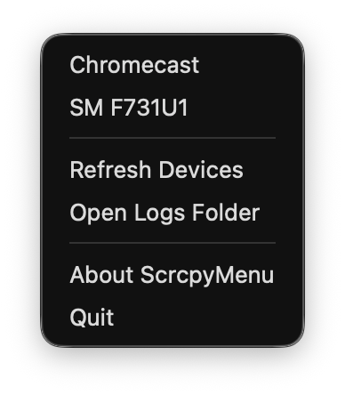

# ScrcpyMenu

macOS 菜单栏工具，作为 [scrcpy](https://github.com/Genymobile/scrcpy) 的轻量 GUI。点击右上角菜单栏图标，选择 Android 设备即可一键启动/停止 scrcpy 投屏窗口。



## 功能

- 菜单栏常驻图标（SF Symbol，自适应深浅色模式）
- 列出 `adb devices` 检测到的所有设备（含无线 adb 设备），显示 human-readable 设备名
- 点击设备启动 scrcpy，再次点击停止；运行中设备带 ● 状态标记
- 打开菜单时自动刷新设备列表，也可手动 Refresh
- `unauthorized` / `offline` 设备置灰并标注状态
- 启动失败时弹窗提示错误信息；每个 scrcpy 进程的输出写入 `~/Library/Logs/ScrcpyMenu/`
- 退出应用时自动清理所有由本应用启动的 scrcpy 进程
- 启动时检查 scrcpy / adb 依赖，缺失时给出安装提示

## 依赖

```bash
brew install scrcpy android-platform-tools
```

## 构建与运行

```bash
make app   # release 构建并打包 ScrcpyMenu.app（ad-hoc 签名）
make run   # 构建并启动
```

或直接使用 SwiftPM：

```bash
swift build -c release
```

## 安装（直接下载）

从 [Releases](https://github.com/kyze8439690/ScrcpyMenu/releases/latest) 下载最新版本的 zip 解压后，由于应用仅做了 ad-hoc 签名（未公证），首次运行需任选一种方式绕过 Gatekeeper：

1. 右键 `ScrcpyMenu.app` → 打开 → 弹窗中点"打开"；
2. 若提示"已损坏/无法验证开发者"，在终端执行：
   ```bash
   xattr -cr /path/to/ScrcpyMenu.app
   ```
   然后正常双击打开；
3. 或在 系统设置 → 隐私与安全性 → 底部点"仍要打开"。

## 技术说明

- 纯 Swift Package（executable target），无 Xcode 工程
- AppKit `NSStatusItem` + `NSMenu`，无第三方依赖
- macOS 13+，Bundle ID: `com.yugy.scrcpy-menu`

## 声明

- 本项目仅为 [scrcpy](https://github.com/Genymobile/scrcpy) 的第三方图形界面封装，与 Genymobile 无任何隶属或官方合作关系。
- scrcpy 版权归 Genymobile 所有，基于 [Apache License 2.0](https://www.apache.org/licenses/LICENSE-2.0) 发布。
